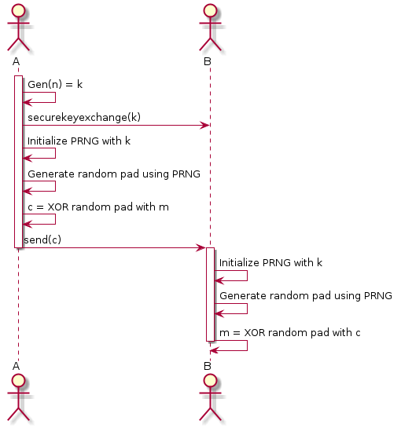

tags: #AC1 #symmetric #StreamCipher #EAV #ComputationalSecurity #private-key

# Private Key Encryption

links [[105 AC1 TOC - Stream Cipher|AC1 TOC - Stream Cipher]] - [[themes/000 Index|Index]]

---
## Private-Key Encryption Scheme

Every private key encryption scheme / cipher consists of three different algorithms:
```
k = Gen(n):
	Gen(n) generates a key k given the security parameter n

c = Enc(k, m):
	Enc(k,m) encrypts a message m given with a given key k, which outputs a 
	ciphertext c

m = Dec(k, c):
	Dec(k,c) decrypts a ciphertext c with a given key k, which outputs decrypted 
	plaintext m
```

### Goals of Private Key Encryption

- Encrypting and decrypting messages in a safe way
- CPA-Secure: Secure against **C**hosen **P**laintext **A**ttacks
- EAV-Secure: EAV means "Secure Against Evesdropping" (which is included in Chosen Plaintext Attacks)
- PPT algorithms (**P**robabilistic **P**olynomial **T**ime algorithms)
- Indistinguishability

### Constructing Private-Key Encryption Scheme
The idea of stream ciphers is to leverage a [[Pseudorandom Number Generator (PRNG)|Pseudorandom Number Generator (PRNG)]] and generate a one-time pad using a key. This pad is then XORed onto the plaintext. This gives a ciphertext. For decryption again take the key and the [[Pseudorandom Number Generator (PRNG)|Pseudorandom Number Generator (PRNG)]] and create the one-time pad. XORing the pad with the ciphertext will result in the plaintext. The key must be generated using the Gen(n) primitive of the respective private-key encryption scheme.

Here a simple example (the lengths are chosen for the example and are not secure):

```
k = Gen(10)     : 0110010010

plaintext m     : 1010

PRNG(k, len(m)) : 0100

encrypt         : m XOR PRNG = 1010 XOR 0100 = 1110
ciphertext c    : 1110

PRNG(k, len(c)) : 0100

decrypt         : c XOR PRNG = 1110 XOR 0100 = 1010 = m
```



#### Algorithms / Building blocks

##### Gen(n) = k
The key must be generated effectively at random using correct techniques (leverage a TRNG). It is used as seed to the PRNG.

##### Enc(k, m) = c
The encryption primitive initializes a PRNG using the generated key `k` as seed. Then it consumes a `len(m)` bit-string of the PRNG to XOR the string with the plaintext `m`, which results in ciphertext `c`.

##### Dec(k, c) = m
The decryption primitve initializes a PRNG using the generated key `k` as seed. Then it cosumes a `len(c)` bit-string of the PRNG to XOR the string with the ciphertext `c`, which results in plaintext `m`

---
links [[105 AC1 TOC - Stream Cipher|AC1 TOC - Stream Cipher]] - [[themes/000 Index|Index]]


 
 
